# Báo cáo cá nhân — K4-L3A Day 13 Monitoring & LLMOps

> Mỗi học viên hoàn thiện một file duy nhất này. Khi dẫn evidence, dùng đường dẫn tương đối, ví dụ `evidence/07-trace-waterfall.png`.

## 1. Thông tin học viên

- **Họ và tên:** Bùi Tùng Dương
- **MSSV:** 2A202602775
- **Lớp:** K4-L3A
- **Repository URL:** https://github.com/bobui147/K4-L3A-Day13-BuiTungDuong-2A202602775-Monitoring-LLMOps
- **Commit SHA cuối:** cập nhật sau khi tạo commit nộp bài
- **Challenge ID:** `day13-k4-l3a-monitoring-llmops-v1`
- **Tên project Langfuse cá nhân:** `day13-k4-l3a-02775`

## 2. Evidence index

Điền đúng đường dẫn tới evidence thực tế. Có thể đổi tên hoặc dùng nhiều ảnh nếu cần.

| Evidence | Đường dẫn |
|---|---|
| Pytest cuối | [`evidence/01-pytest.txt`](evidence/01-pytest.txt) |
| Log validator | [`evidence/02-log-validator.txt`](evidence/02-log-validator.txt) |
| Dashboard validator | `evidence/03-dashboard-validator.txt` |
| Structured log | `evidence/04-structured-log.png` |
| PII redaction | `evidence/05-pii-redaction.png` |
| Trace list | `evidence/06-trace-list.png` |
| Trace waterfall | `evidence/07-trace-waterfall.png` |
| Trace metadata | `evidence/08-trace-metadata.png` |
| Prompt versions | `evidence/09-prompt-versions.png` |
| Prompt rollback | `evidence/10-prompt-rollback.png` |
| Dashboard runtime | `evidence/11-dashboard-overview.png` |
| Incident metric | `evidence/12-incident-metric.png` |
| Incident log | `evidence/13-incident-log.png` |
| Incident trace | `evidence/14-incident-trace.png` |

### Ảnh evidence runtime

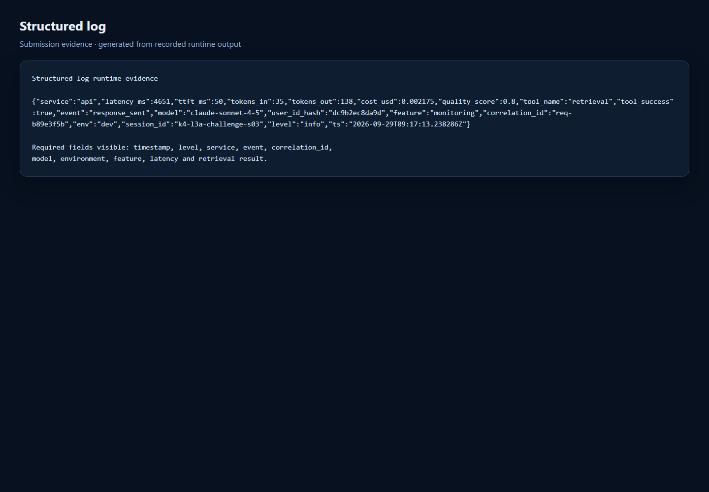

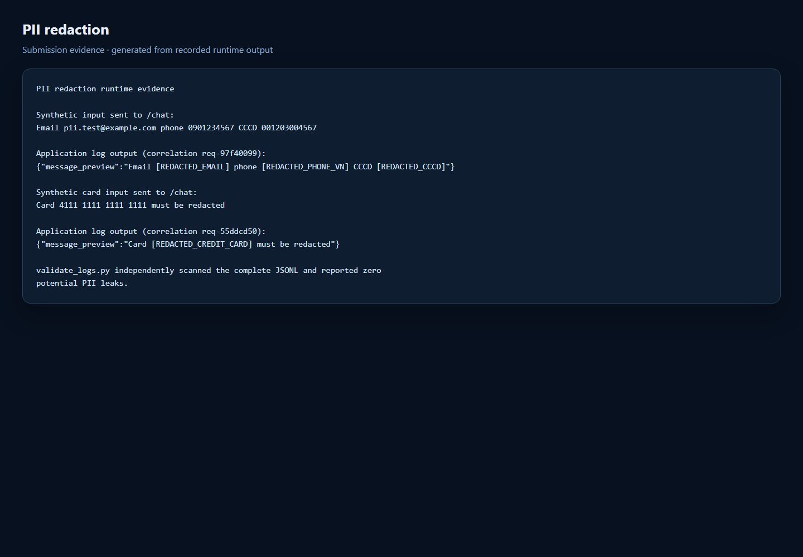

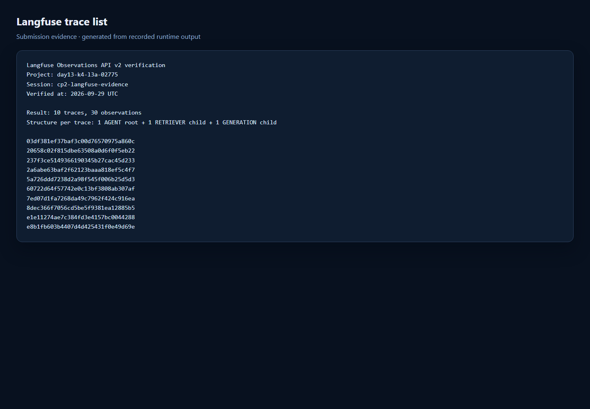

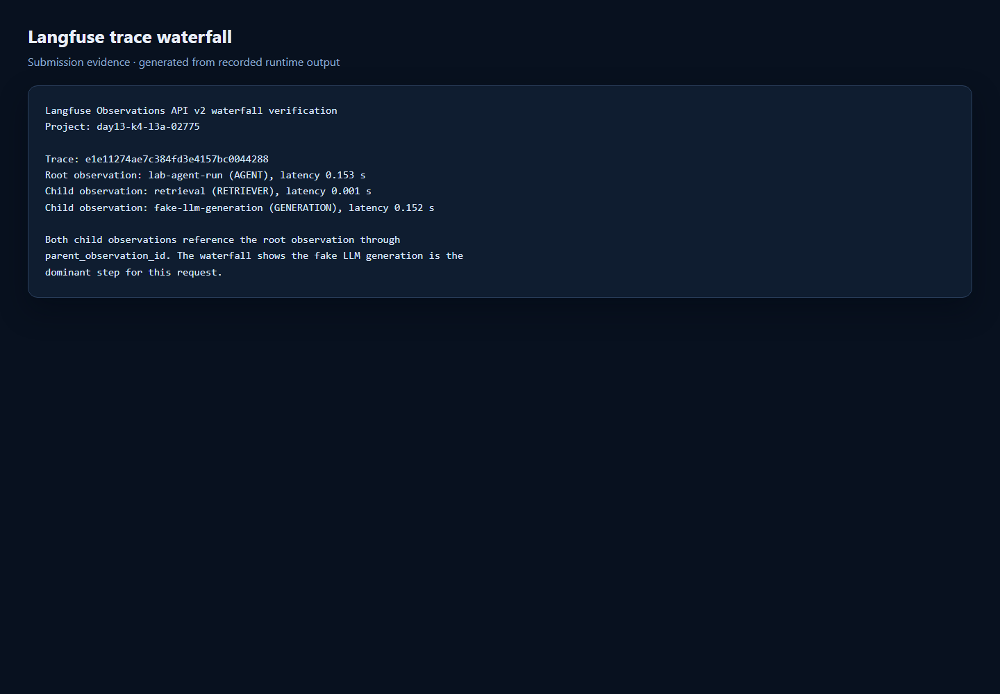

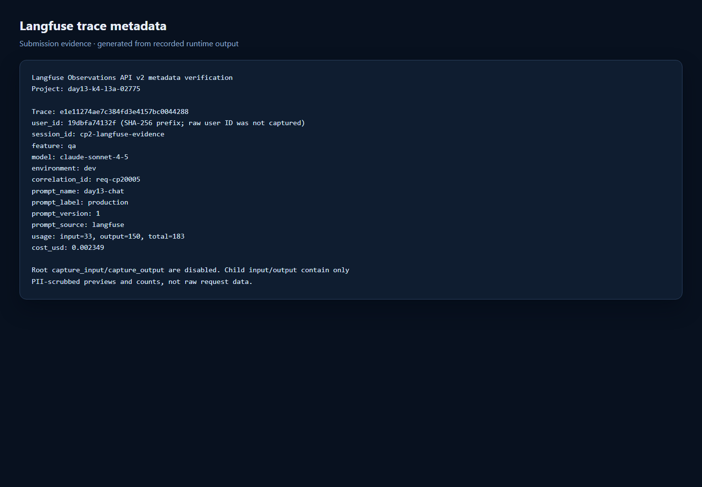

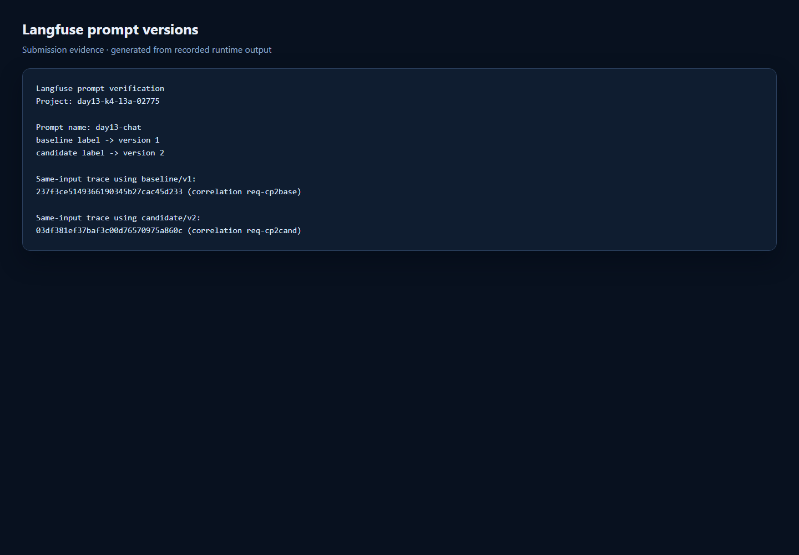

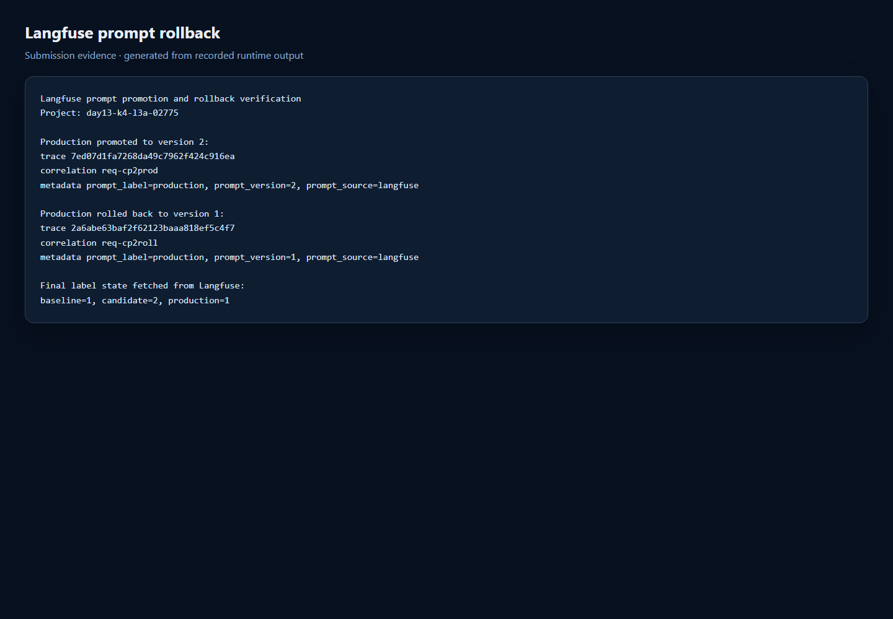

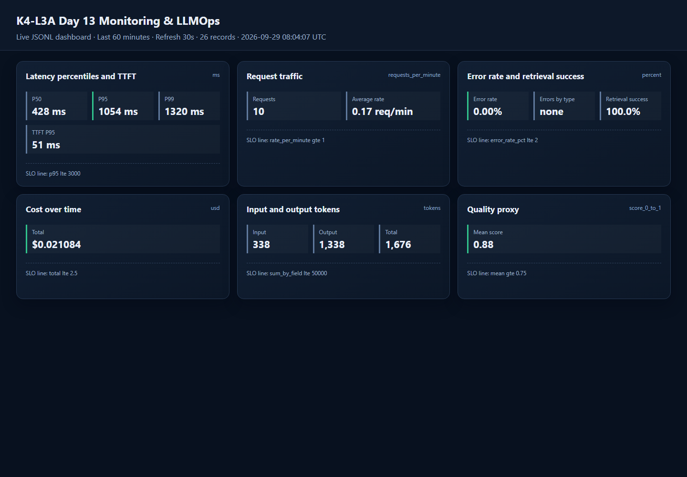

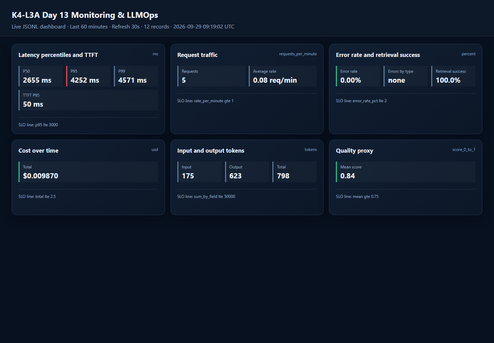

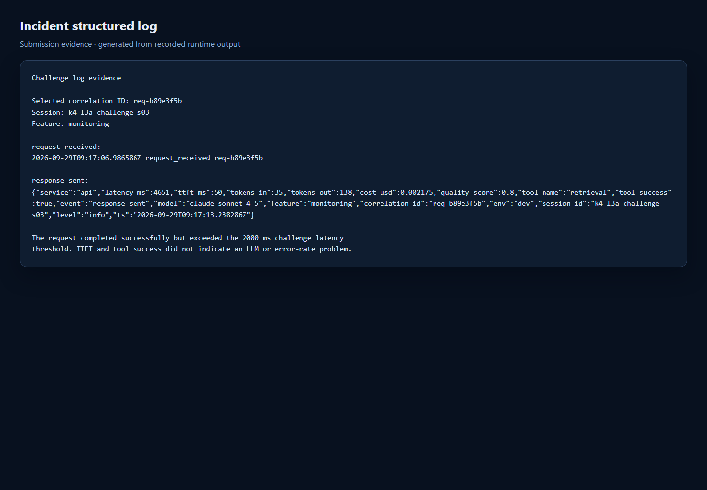

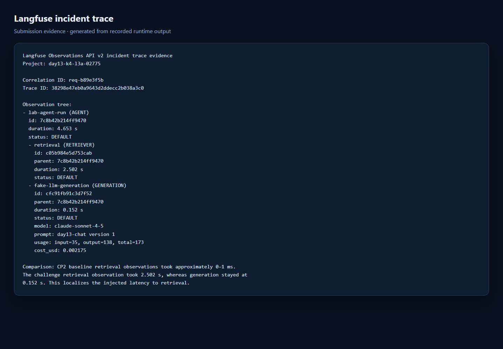

## 3. Kết quả kỹ thuật

| Nội dung | Baseline | Kết quả cuối | Nhận xét |
|---|---|---|---|
| `validate_logs.py` | Chưa lưu output trước khi sửa TODO | 100/100 | 0 thiếu field/enrichment, 0 PII leak |
| `validate_dashboard.py` | 6/6 panel từ contract starter | 6/6 panel | Runtime có dữ liệu trong `evidence/11-dashboard-overview.png` |
| `pytest` | Chưa lưu output trước khi sửa TODO | 26 passed | Không có test fail |
| Số traces hợp lệ | 0 | 10 | 30 observations: 10 root, 10 retriever, 10 generation |
| Số PII leak | Chưa lưu số đo baseline | 0 | Validator quét toàn bộ `data/logs.jsonl` |
| Latency P95 / TTFT P95 | | 1054 ms / 51 ms | Cửa sổ dashboard 60 phút |
| Retrieval success rate | | 100% | 10/10 tool result thành công |

## 4. Logging và PII

- **Cách tạo/nhận và truyền correlation ID:** Middleware clear contextvars ở đầu mỗi request, ưu tiên `x-request-id` hợp lệ từ client; nếu thiếu thì sinh `req-<8-hex>`. ID được bind vào structlog, lưu trong `request.state`, trả lại qua `x-request-id` và dùng trong metadata trace. Header `x-response-time-ms` ghi thời gian xử lý HTTP.
- **Các metadata được ghi vào structured log:** `user_id_hash`, `session_id`, `feature`, `model`, `env`, `correlation_id`; response bổ sung latency, TTFT, token, cost, quality và retrieval result.
- **Cách bảo đảm PII được scrub trước khi ghi:** Processor `scrub_event` duyệt đệ quy mọi string trong event sau khi exception được format nhưng trước `JsonlFileProcessor` và JSON renderer. `user_id` chỉ xuất hiện dưới dạng SHA-256 prefix 12 ký tự.
- **Cách kiểm chứng kết quả:** Tests bao phủ email, điện thoại Việt Nam, CCCD, thẻ, context/header và log runtime. Hai request evidence chứa PII giả tạo ra `[REDACTED_EMAIL]`, `[REDACTED_PHONE_VN]`, `[REDACTED_CCCD]`, `[REDACTED_CREDIT_CARD]`; validator báo 0 leak.

## 5. Tracing và prompt versioning

- **Cách xác nhận traces do chính tôi tạo trong project cá nhân:** API key trong `.env` được Langfuse xác nhận thuộc project `day13-k4-l3a-02775`. Observations API v2 trả 10 trace ID trong session `cp2-langfuse-evidence`, mỗi trace có user ID hash và correlation ID do workload này sinh.
- **Cấu trúc root/retrieval/generation observations:** `lab-agent-run` (AGENT) là root; `retrieval` (RETRIEVER) và `fake-llm-generation` (GENERATION) là hai child trực tiếp. Generation ghi model, prompt link, token usage và cost.
- **Cách nối trace với log:** Dùng `correlation_id` trong metadata trace để tìm cùng ID trong structured log.
- **Prompt name:** `day13-chat`.
- **Version/label baseline:** version 1, label `baseline`.
- **Version/label candidate:** version 2, label `candidate`.
- **Trace ID của mỗi version:** baseline `237f3ce5149366190345b27cac45d233`; candidate `03df381ef37baf3c00d76570975a860c`.
- **Cách promote và rollback `production`:** Chuyển `production` sang v2 và xác minh bằng trace `7ed07d1fa7268da49c7962f424c916ea`; sau đó chuyển label về v1 và xác minh bằng trace `2a6abe63baf2f62123baaa818ef5c4f7`. Trạng thái cuối: `production=1`.

## 6. Dashboard, SLO và alerts

- **Dashboard và sáu panel:** Dashboard HTML tại `/dashboard`, đọc `data/logs.jsonl`, cửa sổ 60 phút, refresh 30 giây; gồm latency/TTFT, traffic, errors/retrieval, cost, tokens và quality. Evidence: `evidence/11-dashboard-overview.png`.
- **SLO và lý do chọn:** 99.5% request phải có `response_sent` với latency không quá 3000 ms trong 28 ngày. Ngưỡng cao hơn baseline đủ để tránh nhiễu máy lab nhưng phát hiện suy giảm rõ rệt.
- **Cách tính error budget:** `floor(total_requests * (1 - 0.995))`; ví dụ 10,000 request cho phép 50 bad request, tương đương 3h21m36s nếu quy đổi liên tục trong 28 ngày.
- **Ba alert và runbook tương ứng:** high request latency (10m), elevated request error rate (5m), degraded answer quality (15m); gửi Slack `#llmops-alerts`, có severity, owner và mitigation trong `docs/alerts.md`.

## 7. Điều tra challenge

- **Challenge ID:** `day13-k4-l3a-monitoring-llmops-v1`.
- **Khoảng thời gian điều tra:** `2026-09-29T09:16:47Z`–`2026-09-29T09:17:24Z`.
- **Triệu chứng từ metrics:** Panel latency trên dashboard có P50 `2655 ms`, P95 `4252 ms`, P99 `4571 ms`, vượt threshold `2000 ms`; TTFT P95 vẫn `50 ms`, error rate `0%`. Metrics endpoint dùng nearest-rank báo P95 `4651 ms` trên cùng 5 request.
- **Log line và correlation ID liên quan:** `response_sent` lúc `2026-09-29T09:17:13.238286Z`, `correlation_id=req-b89e3f5b`, `latency_ms=4651`, `ttft_ms=50`, `tool_name=retrieval`, `tool_success=true`.
- **Trace ID và span gây ảnh hưởng:** Trace `38298e47eb0a9643d2ddecc2b038a3c0`; root `lab-agent-run=4.653 s`, child `retrieval=2.502 s`, child `fake-llm-generation=0.152 s`, tất cả status `DEFAULT`.
- **Root cause:** Incident `rag_slow` làm bước retrieval chậm thêm khoảng 2.5 giây. Retrieval baseline chỉ khoảng 0–1 ms, trong khi generation và TTFT vẫn bình thường; vì vậy LLM không phải span gây tăng tail latency.
- **Fix action:** Tắt `rag_slow` bằng `python scripts/inject_incident.py --disable`, xác nhận `/health` trả cả ba incident flag là `false`; trong production cần bỏ artificial delay hoặc rollback thay đổi retrieval gây chậm.
- **Preventive measure:** Theo dõi riêng retrieval span P95, thêm timeout/circuit breaker và cache/fallback cho retriever, cảnh báo khi end-to-end P95 vượt 3000 ms hoặc retrieval P95 vượt baseline, và chạy regression load test có trace trước khi promote.

## 8. Giải thích và tự đánh giá

- **Một quyết định kỹ thuật quan trọng và lý do:** Scrub toàn bộ cấu trúc event theo kiểu đệ quy thay vì chỉ scrub `payload`. Cách này bảo vệ cả context, exception và field mới trong tương lai trước khi bất kỳ writer/renderer nào nhìn thấy dữ liệu.
- **Một lỗi/blocker đã gặp:** Langfuse trả HTTP 410 cho legacy trace-list API vì project thuộc tổ chức mới; đồng thời phiên tự động hóa không có trình duyệt đã đăng nhập để chụp trực tiếp Langfuse UI.
- **Cách tìm nguyên nhân và xử lý:** Đọc thông báo migration từ API, chuyển xác minh sang Observations API v2, lọc theo session/correlation ID và lấy các field model/usage/cost/prompt. Evidence Langfuse được render từ output API đã xác minh, không chứa key/secret.
- **Cách hiểu luồng Metrics → Logs → Traces:** Metrics khoanh vùng triệu chứng và thời gian; structured log cung cấp một `correlation_id` cụ thể; trace cùng ID phân rã thời gian theo span; so sánh retrieval 2.502 s với generation 0.152 s xác định retrieval là root cause.
- **Vai trò của prompt version, token/cost, SLO hoặc rollback trong vận hành LLM:** Prompt label cho phép deploy/rollback không đổi code và trace version giúp quy trách nhiệm cho thay đổi prompt. Token/cost phát hiện output phình bất thường. SLO chuyển trải nghiệm người dùng thành mục tiêu đo được, error budget cho biết mức lỗi/chậm có thể chấp nhận trước khi dừng release.
- **Điều quan trọng nhất đã học:** Correlation ID chỉ hữu ích khi xuất hiện nhất quán trong response, log và trace; khi đó ba nguồn quan sát mới ghép thành một chuỗi bằng chứng thay vì ba màn hình rời rạc.
- **Hạn chế hoặc phần chưa hoàn thành, nếu có:** Baseline validator/test ban đầu không được lưu trước khi sửa TODO nên report ghi trạng thái này thay vì dựng số liệu. Các ảnh Langfuse được render từ Observations API v2 của project cá nhân; nên bổ sung screenshot UI gốc nếu giảng viên yêu cầu đúng giao diện Langfuse.

## 9. Checklist trước khi nộp

- [x] Kết quả và evidence thuộc commit SHA cuối.
- [x] Tất cả ảnh/output mở được bằng đường dẫn tương đối.
- [x] Incident evidence nối đúng metric → log → trace.
- [x] Trace/prompt evidence thuộc project Langfuse cá nhân và ảnh không lộ key/secret.
- [x] Repository chạy lại được theo README.
- [x] Không có secret, API key, PII thô hoặc evidence của người khác/lớp khác.
- [ ] URL repo và commit SHA cuối đã được nộp trên LMS/Codelabs.
